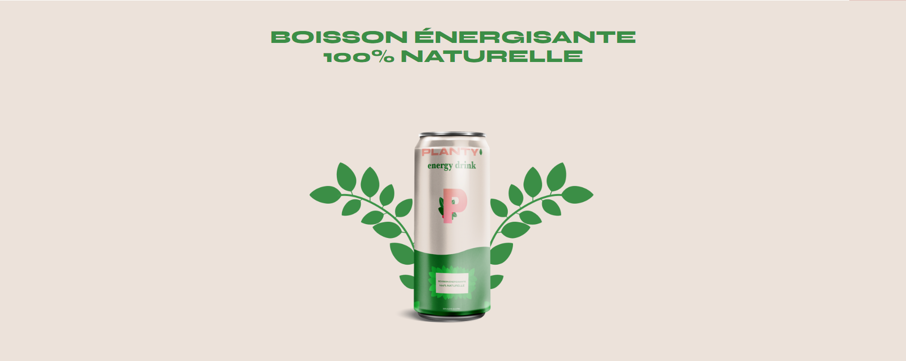

# Projet Developpeur - WordPress - OpenClassrooms

### Here's a link to  
<a href="https://raquel-salamone.fr/planty/" target="_blank" alt=Planty style="margin-top: 10px;">Planty</a>
 
<a href="https://www.figma.com/file/bcc8q196ZE5RKN1r50hRt8/Maquette-Planty-P6-Wordpress?type=design&node-id=0-1&mode=design" target="_blank" alt= Maquette Booki style="margin-top: 10px;"> Maquette Design</a>
 

---

### Projet 3 - Planty  
Planty a besoin d’un site pour présenter son activité ainsi que pour obtenir des premières précommandes. 

### Obectif : 
Vous êtes intégrateur WordPress dans une agence web, et êtes en charge du développement du site vitrine de Planty, une jeune marque de boissons énergisantes à base de plantes.
 

---

